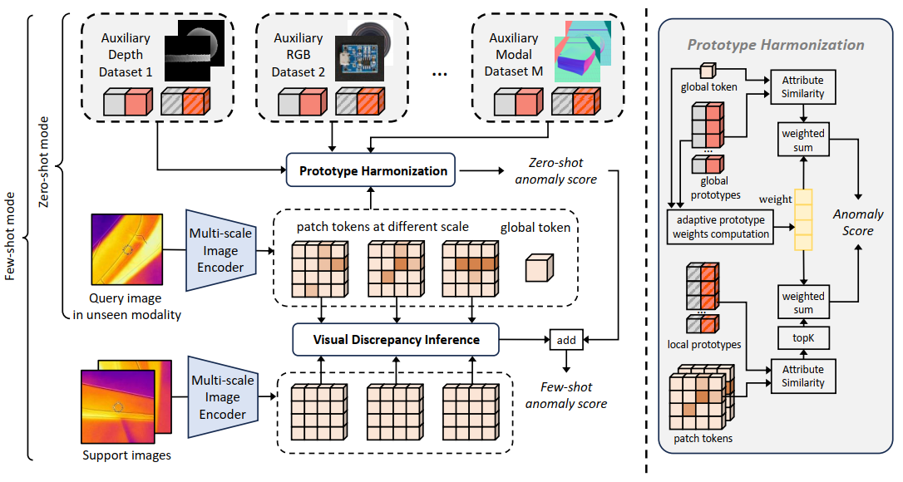
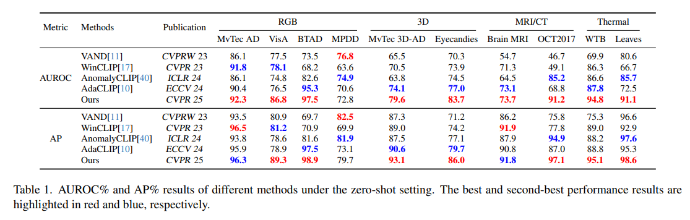
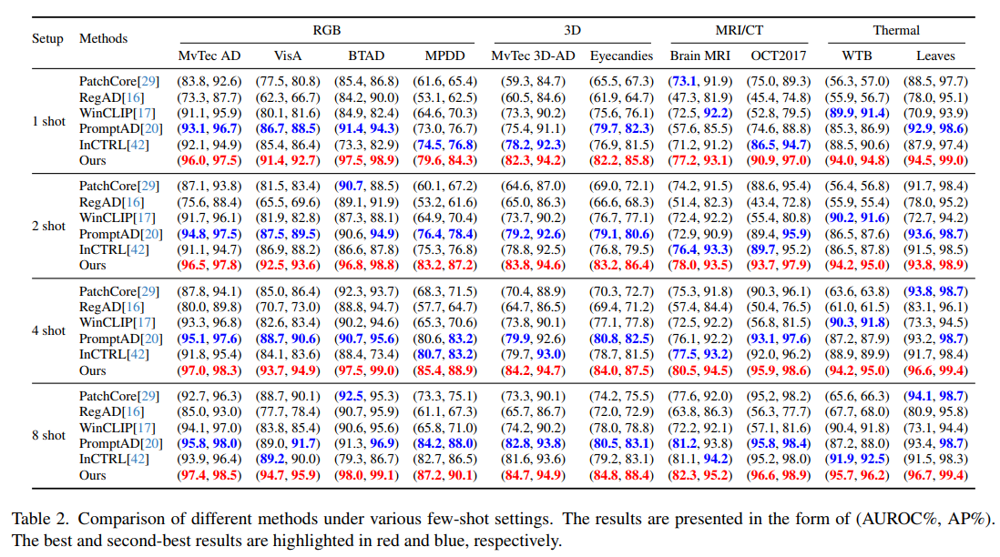

# Beyond Single-Modal Boundary: Cross-Modal Anomaly Detection through Visual Prototype and Harmonization

This repository provides the official implementation of [**Beyond Single-Modal Boundary: Cross-Modal Anomaly Detection through Visual Prototype and Harmonization**](https://openaccess.thecvf.com/content/CVPR2025/papers/Mao_Beyond_Single-Modal_Boundary_Cross-Modal_Anomaly_Detection_through_Visual_Prototype_and_CVPR_2025_paper.pdf).

We study cross-modal anomaly detection, where a model is trained on known modalities and tested on unseen ones. To improve generalization, our method learns Transferable Visual Prototypes directly in the visual space and uses Prototype Harmonization to adaptively combine prototypes from different source modalities. For few-shot settings, Visual Discrepancy Inference further enhances detection by comparing query images with a few normal samples from the target modality.

Experiments on ten datasets across RGB, 3D, MRI/CT, and thermal modalities show that our method achieves strong zero-shot and few-shot anomaly detection performance.

<!-- 

  

  Overview of the proposed cross-modal anomaly detection framework.

 -->

## Environment Setup

## Data Preparation

## Run on Zero-Shot Setting

<!-- 

  

  Results under zero-shot setting.

 -->

## Run on Few-Shot Setting

<!-- 

  

  Results under few-shot setting.

 -->

