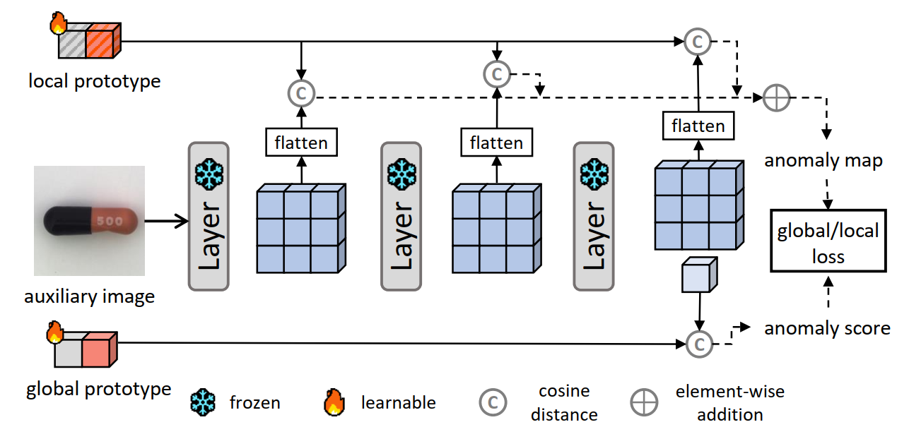
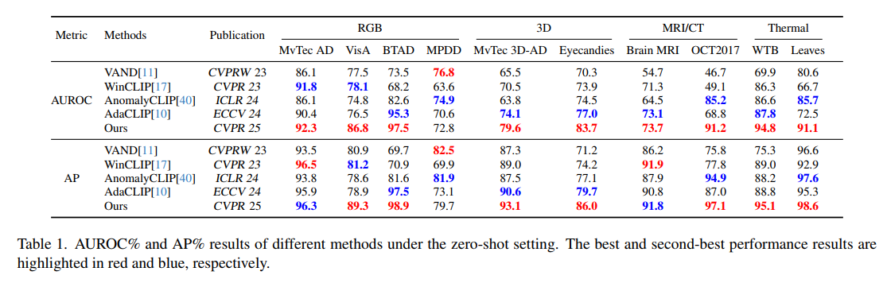
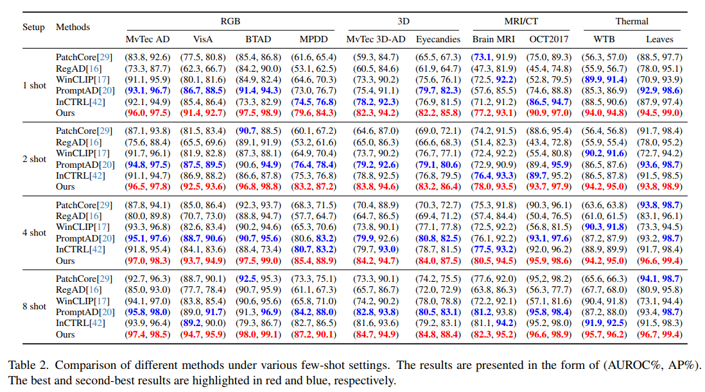

# [CVPR2025] Beyond Single-Modal Boundary: Cross-Modal Anomaly Detection through Visual Prototype and Harmonization

This repository provides the official implementation of [**Beyond Single-Modal Boundary: Cross-Modal Anomaly Detection through Visual Prototype and Harmonization**](https://openaccess.thecvf.com/content/CVPR2025/papers/Mao_Beyond_Single-Modal_Boundary_Cross-Modal_Anomaly_Detection_through_Visual_Prototype_and_CVPR_2025_paper.pdf).

We study cross-modal anomaly detection, where a model is trained on known modalities and tested on unseen ones. To improve generalization, our method learns Transferable Visual Prototypes directly in the visual space and uses Prototype Harmonization to adaptively combine prototypes from different source modalities. For few-shot settings, Visual Discrepancy Inference further enhances detection by comparing query images with a few normal samples from the target modality.

Experiments on ten datasets across RGB, 3D, MRI/CT, and thermal modalities show that our method achieves strong zero-shot and few-shot anomaly detection performance.

<p align="center">
  
</p>
<p align="center">
  Overview of training process in our proposed cross-modal anomaly detection framework.
</p>

---


## Environment Setup
The code runs on a server equipped with 10 NVIDIA GeForce RTX 3090 GPUs under the following environment:
- Python 3.10.0
- PyTorch 2.5.1 + CUDA 11.8
- torchvision 0.20.1 + CUDA 11.8
- NumPy 1.26.3
- OpenCV 4.10.0
- scikit-learn 1.5.2
- scikit-image 0.24.0
- pandas 2.2.3
- matplotlib 3.10.0
- tqdm 4.67.1
- einops 0.8.0


## Data Preparation
### Download the datasets
We use ten public datasets across four modalities for cross-modal anomaly detection, including RGB datasets (MVTec AD, VisA, BTAD, and MPDD), 
3D datasets (MVTec 3D-AD and Eyecandies), MRI/CT datasets (Brain MRI and OCT2017), and thermal datasets (WTB and Leaves).
- RGB: [MvTec AD](https://www.mvtec.com/research-teaching/datasets/mvtec-ad), [VisA](https://github.com/amazon-science/spot-diff), [BTAD](https://www.kaggle.com/datasets/thtuan/btad-beantech-anomaly-detection/data), [MPDD](https://github.com/stepanje/MPDD)
- 3D: [MVTec 3D-AD](https://drive.google.com/file/d/1KlfQtat791iFGpXFuQ-9cDhiBvrkEmBL/view?usp=drive_link), [Eyecandies](https://drive.google.com/file/d/1SbbPLt6Vf6rGJkUmuRikoqYpQAYc6hLg/view?usp=drive_link)
- MRI/CT: [Brain MRI](https://drive.google.com/file/d/130MmIGo81ZpxQIaA70NCjRcyfC2U9x0v/view?usp=drive_link), [OCT2017](https://drive.google.com/file/d/11mPughb6KAPyVlwCW2NmzxmxcUzOWSyG/view?usp=drive_link)
- Thermal: [WTB](https://drive.google.com/file/d/1pv3XT2lI2UVUpFvnddWZMiiIqqX-Eogq/view?usp=drive_link), [Leaves](https://drive.google.com/file/d/12ZDsbNS8cg7VeOVCkNYqTQwKcsaJ09YP/view?usp=drive_link)

### Convert datasets to the MVTec-style structure
After downloading the datasets, reorganize them into the standard MVTec AD format. Each category should contain train, test, and ground_truth folders, 
where normal training images are placed in train/good, test images are placed in test/good or test/<defect_type>, and pixel-level masks are placed in ground_truth/<defect_type> if available.

```text
<dataset_name>/ 
└── <category_name>/
  ├── train/good/ 
  ├── test/good/ 
  ├── test/<defect_type>/ 
  └── ground_truth/<defect_type>/ 
  ...
```

The json files for each dataset can be downloaded from [json files](https://drive.google.com/file/d/1O4qR1H9Np8FRs674Bbea1EjL1JXWrXHq/view?usp=drive_link). For few-shot evaluation, the normal support samples for 1, 2, 4, and 8-shot settings are randomly generated and keep fixed across different methods for fair comparison, and can be downloaded from [few-shot data](https://drive.google.com/file/d/1mHn8XutpiEImpyrgWG4DFC63QLG1Aa14/view?usp=drive_link).


## Run on Zero-Shot Setting

For zero-shot training and evaluation, simply run the corresponding bash script:

```text
  bash train_zero_shot.sh
```
```text
  bash test_zero_shot.sh
```

<p align="center">
  
</p>
<p align="center">
  Results under zero-shot setting.
</p>


## Run on Few-Shot Setting

For few-shot evaluation, simply run the corresponding bash script:
```text
  bash test_few_shot.sh
```

<p align="center">
  
</p>
<p align="center">
  Results under few-shot setting.
</p>


## Citation
```text
  @inproceedings{mao2025beyond,
  title={Beyond single-modal boundary: Cross-modal anomaly detection through visual prototype and harmonization},
  author={Mao, Kai and Wei, Ping and Lian, Yiyang and Wang, Yangyang and Zheng, Nanning},
  booktitle={Proceedings of the Computer Vision and Pattern Recognition Conference},
  pages={9964--9973},
  year={2025}
}
```


